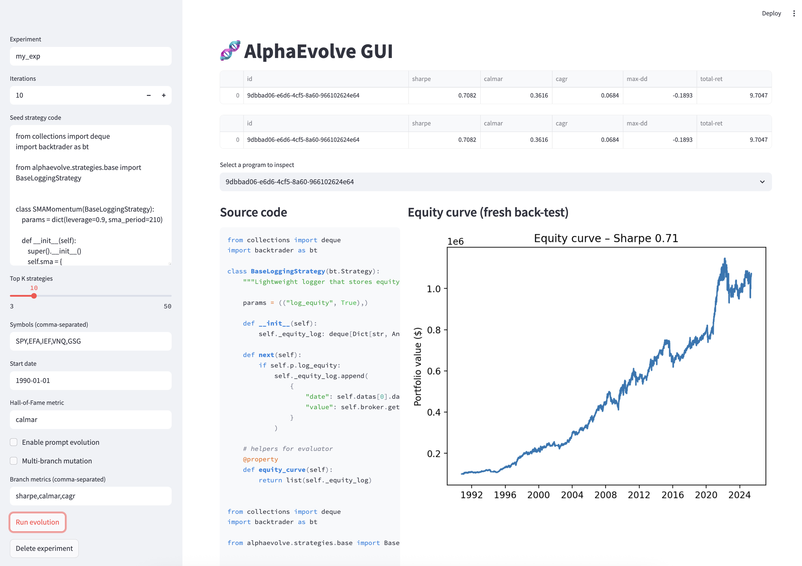

# AlphaEvolve

> **Inspired by [DeepMind’s AlphaEvolve coding agent](https://deepmind.google/discover/blog/alphaevolve-a-gemini-powered-coding-agent-for-designing-advanced-algorithms/)**—this project applies the same evolutionary-LLM principles to financial markets.

**Autonomously discovers and back‑tests high‑performing algorithmic‑trading strategies** using evolutionary LLM prompts, Backtrader, and the Papers‑With‑Backtest data ecosystem.



---

## 🚀 Quickstart

```bash
# Clone and install in editable mode
$ git clone https://github.com/paperswithbacktest/pwb-alphaevolve.git
$ cd pwb-alphaevolve
$ pip install -e .

# Set your OpenAI key (model "o3" required)
$ export OPENAI_API_KEY=sk-...
# Set your Papers‑With‑Backtest dataset (e.g. "paperswithbacktest/Stocks-Daily-Price")
$ export HF_ACCESS_TOKEN=hf_
```

Seed strategy code can be found on [paperswithbacktest.com](https://paperswithbacktest.com/) and the required data for the backtest can be obtained from [paperswithbacktest.com/datasets](https://paperswithbacktest.com/datasets).

Launch and monitor an experiment entirely from the GUI:

```bash
$ streamlit run scripts/gui.py
```

The sidebar lets you paste a seed strategy, tune the options from
`examples/config.py` and pick the number of iterations. Click **Run evolution** to start
the search and watch the hall‑of‑fame table update live.

Alternatively you can launch the evolution controller (create a fresh experiment)

```bash
python scripts/run_example.py --experiment my_exp
```

### Managing experiments

Use the `--experiment` option to keep runs separate:

```bash
python scripts/run_example.py --experiment my_exp
```

This creates a new SQLite file `my_exp.db` under `~/.alphaevolve/`. The GUI lists all experiments, allowing you to switch between them or delete one via the **Delete experiment** sidebar button.

---

## ⚙️  Installation

> **Python ≥ 3.10** required.

```bash
pip install pwb-alphaevolve
```

Or install the bleeding‑edge version:

```bash
pip install git+https://github.com/paperswithbacktest/pwb-alphaevolve.git
```

### Core Dependencies

* [pwb-toolbox](https://github.com/paperswithbacktest/pwb-toolbox)
* [pwb-backtrader](https://github.com/paperswithbacktest/pwb-backtrader)
* openai ≥ 1.0 (structured output)
* tqdm, pandas, numpy, pydantic


(See `pyproject.toml` for the full list.)

---

## 🦙 Using Local LLMs

AlphaEvolve can operate without OpenAI by loading a HuggingFace model or by
forwarding requests to an OpenAI-compatible server. Install the optional
dependencies and download a model first:

```bash
pip install transformers accelerate bitsandbytes
huggingface-cli download microsoft/phi-2 --local-dir ~/.cache/phi-2
```

Configure the environment to use the local backend:

```bash
export LLM_BACKEND=local
export LOCAL_MODEL_PATH=~/.cache/phi-2  # or set LOCAL_MODEL_NAME
# LOCAL_SERVER_URL=http://localhost:8000  # optional OpenAI-style server
```

Run the evolution loop with the local model:

```bash
python scripts/run_example.py --experiment my_exp
```

---


## ✨ Key Features

| Layer      | Highlights                                                                                  |
| ---------- | ------------------------------------------------------------------------------------------- |
| Data       | Zero‑setup loader for any Papers‑With‑Backtest dataset (`pwb_toolbox`) + caching to Feather |
| Strategies | Seed templates with **EVOLVE‑BLOCK** markers that the LLM mutates                           |
| Evaluator  | Deterministic Backtrader walk‑forward, JSON KPIs (Sharpe, CAGR, Calmar, DD)                 |
| LLM Engine | OpenAI o3 structured‑output chat → JSON diff/patch system                                   |
| Evolution  | Async controller, SQLite hall‑of‑fame, optional MAP‑Elites niches                           |
| Dashboard  | (optional) Streamlit live view of metrics & equity curves                                   |

---

## 📂 Project structure (high‑level)

```
alphaevolve/
├── engine.py      # convenience wrapper to run the evolution loop
├── evaluator/     # data loading, metrics & Backtrader evaluation
├── evolution/     # controller, patching, islands
├── llm_engine/    # prompt builder + OpenAI client
├── strategies/    # seed strategies (EVOLVE‑BLOCK markers)
└── store/         # SQLite persistence
scripts/           # CLI entry‑points
```

---

## Prompt Evolution

The `PromptGenome` dataclass allows the LLM instructions themselves to be
evolved using a genetic algorithm. Set `ENABLE_PROMPT_EVOLUTION = True` in
`examples/settings.py` to try this feature. New prompts are mutated, evaluated
for a few iterations and stored in a separate SQLite database.

---

## 🤝 Contributing

1. Fork the repo & create your feature branch (`git checkout -b feat/new-feature`).
2. Commit your changes (`git commit -m 'feat: add something'`).
3. Push to the branch (`git push origin feat/new-feature`).
4. Open a Pull Request.

Please run `black` + `ruff` before submitting.

---

## 📄 License

MIT © 2025 Contributors
